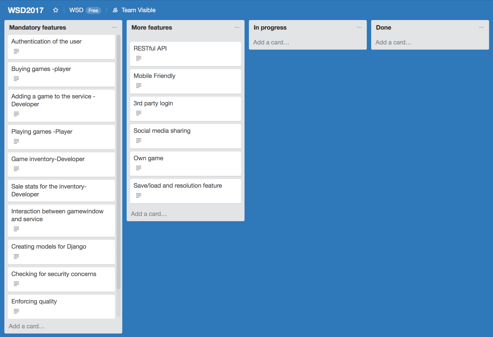

__Team__  
   473420 Max Estlander  
   529329 Lauri Koskela  
   528485 Rasmus Blässar  

__Goal__  
In this project, we will build an online game store for javascript games. The service will support both players and developers. Developers will be able to sell their games to the service and players to buy and play them on the platform.

The project will be coded using Django framework.

__Plans__

We have created backlog in Trello and listed all features in mandatory and more features tabs. Our plan is to first implement all mandatory features well and add more features if there is enough time.

Features and implementations:  
_Authentication of the user:_ This will be done with django authentication which was provided in the project instructions.  
Buying games (player): The player must be able to buy games from the service, this will be done with models and the payment service. The player will gain permission to the game after purchase.  
Playing games (player): The player must be able to play the game purchased. For this purpose we will implement a game window in an iframe, which will run the game javascript code. The games won’t be uploaded to the server.  
Game inventory (developer): Users that are developers will have access to their own Inventory. The developers can modify only their own inventories. The inventory will be displayed through the models of Developer and Game.  
Adding a game to the service: Developers must be able to add games to the service, this is done through adding a game to the database.  
Sale stats for the inventory: Developer must be able to see how many games have been purchased and how much money they have generated. This is done through accessing the database for the developers games and querying the amount and price.  
Interaction between gamewindow and service: As the game will run in an iframe it will communicate with the service with postMessage. The service must be also able to communicate with the service which can be done with an eventListener that can store the json sent to the game and execute its content  
Creating models for Django: Creating the appropriate models that we can use in the project.  
Checking for security concerns: Testing risky points of the service.  
Enforcing quality: Using a linter, commenting, thinking about UX and testing.  
Deploying to HEROKU: Using heroku to run the service, first by testing it with a simple file and later with the full service. Heroku turns off after sometime of inactivity so the time limit can be almost disregarded.

Initial Django models:  
Developer and Player will be part of the same model and have OneToOne relation with the User module in Django. They will belong to different groups (Developers and Players) and get their permission from there. They will also have a owned games field which is a many to many field with games.  
Games will have their own model where they get the following fields: name (char field), description (text field), url (URL field), price (float field), date of publication (Date time field), picture (url field), times purchased (integer field) and developer (foreign key to users profile).  
Highscores will also have an own model with the following fields: player name (from player db), game name (from game db) and score (float field).

__Process and Time Schedule__ 
We will not be working on winter break but after that we will start meeting face-to-face once a week for a long period of time (5+ hours) during which we will try to get everything done so we won’t have to meet-up or work at home extra. If needed however we will start meeting more or doing extra work at home.

__Testing__  
Testing will be mostly done manually using django’s runserver command through which we can simulate the deployed server. Some testing will be necessary to ensure that developer and player accounts won’t get mixed up and that developers have access to only their own inventories.
The heroku server must also be tested when the game is deployed.

__Risk Analysis__ 
We will deploy our service to an external Heroku server, so the server security is not in our hands.
We will secure our the whole site with https, except with the provided payment service.
Https will secure the transfers between the clients and server, and protect against man in the middle attacks. We will use a free ssl certificate from Let’s Encrypt to enable this.
Additional security measures will be taken by following django's best practices and security instructions. Django has many build in features to protect against common risks.

Cross site scripting (XSS) protection  
Using Django templates protects you against the majority of XSS attacks.

Cross site request forgery (CSRF) protection  
Django has built-in protection against most types of CSRF attacks ( CSRF module )

SQL injection protection  
Django’s querysets are protected from SQL injection since their queries are constructed using query parameterization.

And of course we will not share any secret keys in code and version control.
