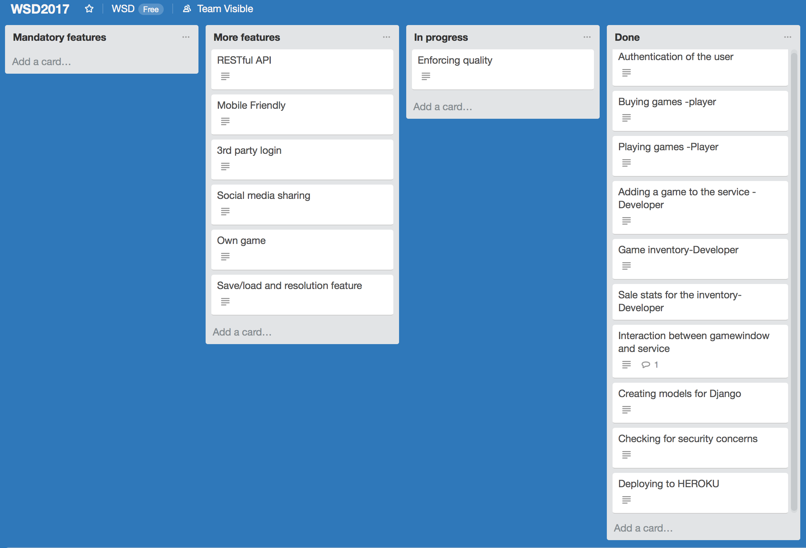

__Picture of backlog final state__  

__Minimum functional requirements__

Done

__Authentication (mandatory, 100-200 points):__

Done everything except the email validation  
100/200

__Basic player functionalities (mandatory, 100-300 points):__

All done except categories or search function  
250/300

__Basic developer functionalities (mandatory 100-200 points):__

Games only dev can add games to their own inventories, dev’s can’t modify but would be unfair to remove games as they would be removed from players aswell, so it’s a feature!  
200/200

__Game/service interaction (mandatory 100-200 points):__

You can submit score and updates latest submitted score will be shown, highscores only update when page is reloaded or you view leaderboard page  
150/200

__Quality of Work (mandatory 0-100 points)__

No test code was written but all uses cases were tested, Styling is decent in our opinion.  
75/100

__Non-functional requirements (mandatory 0-200 points)__

Project plan was conclusive and teamwork went well in our opinion. Documentation might be a little lacking.  
175/200

__Problems__

We tried creating a structure with multiple apps but started run into more issues with it than we saw it gave benefit and switched to moving all models etc. to the same folder.

We also tried implementing save and load feature but had problems with getting javascript to parse the string after it was saved and getting csrf issues.

We had problems with serving media files and could not get game thumbnails to load. Apparently, heroku does not preserve user uploaded media files between dynos restarts. To fix this we would need to use another storage solution like AWS S3.

__Dividing the work__

At the start we tried to working in the same space. However we are working on another project currently together that has some same or similar things(bootstrap, deploying to a server) so people gravited towards what they were more familiar with and felt they would benefit from doing more of.

Rasmus did layout and design of the website and also payment and authentication, Lauri did the deploying and Max did the playgame and highscore part. But alot of the work that we did early on was more done together.

__Link and instructions__

Link: https://salty-mesa-49148.herokuapp.com/

You can find the registration link from the account dropdown menu. If you register as a developer you can find the register game link from the account menu. The rest should be fairly self-explanatory. Link currently has debugging as true because we ran into last minute issues
